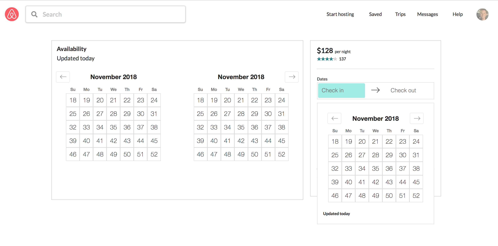
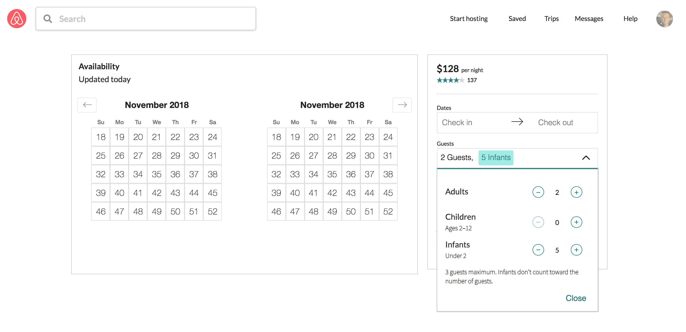

# Project Name

Hopping Couch check out availability module

## Related Projects

  - https://github.com/Aircnc/description-module
  - https://github.com/Aircnc/image-module
  - https://github.com/Aircnc/reviews-module

## Table of Contents

1. [Screenshot](#Screenshot)
2. [Requirements](#Requirements)
3. [Development](#Development)
4. [Integration with proxy](#Integration)

## Screenshot




## Requirements


- Node 10.9
- MongoDB 3.4

## Development

### Make changes to exiting module

From within the root directory:

```sh
npm install
npm run seed
npm run watch
npm start:dev
```

### Run module as it is

From within the root directory:

```sh
npm install
npm run seed
npm run build
npm start
```

## How to integrate module with your proxy
1. make sure to include following css links in your proxy index.html
    ```sh
    <link rel="stylesheet" href="//cdn.jsdelivr.net/npm/semantic-ui@2.4.0/dist/semantic.min.css">
    <link rel="stylesheet" href="https://cdnjs.cloudflare.com/ajax/libs/font-awesome/4.7.0/css/font-awesome.min.css">
    <link href="https://fonts.googleapis.com/css?family=Lato" rel="stylesheet">
    <link href="https://fonts.googleapis.com/css?family=Roboto:100|Source+Sans+Pro:200" rel="stylesheet">
    ```
2. make sure to include following ids in your div for nav bar and main body
    ```sh
    <div id="nav-alice"></div>
    <div id="main-body"></div>
    ```
3. make sure to include following script tag
    ```sh
    <script src=`http://localhost:3001/listings/${id}/aval.bundle.js`></script>
    ```